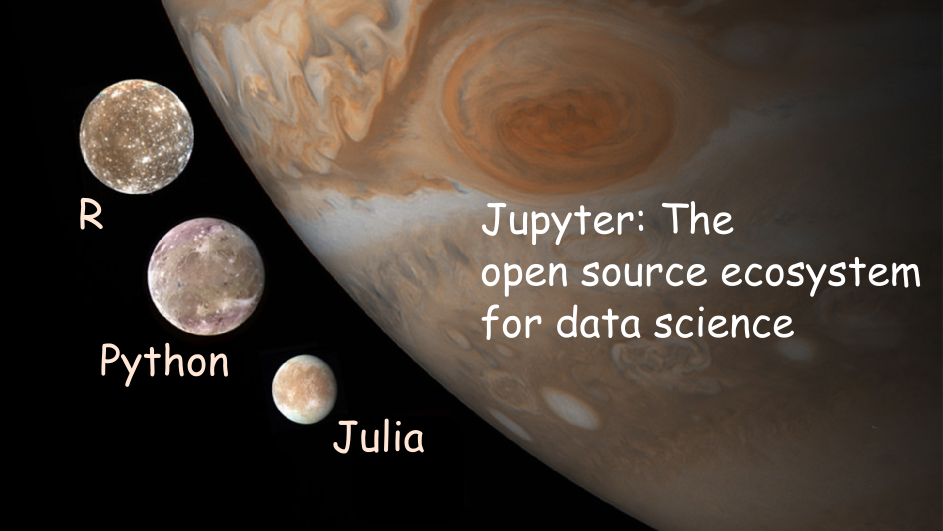

Overview of the **Ju**lia-**Py**thon-**R** Universe
---------------------------------------------------

A side-by-side review of the main open source ecosystems supporting the [Data Science](Data%20Science "wikilink") domain: Julia, Python, R, sometimes abbreviated as *Jupyter*.

### Motivation

A large component of [Quantitative Risk Management](Quantitative%20Risk%20Management "wikilink") relies on data processing and quantitative tools (aka [Data Science](Data%20Science "wikilink")). In recent years [open source](:Category:Open%20Source "wikilink") software targeting Data Science finds increased adoption in diverse applications. The **Overview of the Julia-Python-R Universe** article is a side by side comparison of a wide range of aspects of Python, Julia and R language ecosystems. The comparison of the three ecosystems aims:

-   To be useful for people that are somewhat familiar with programming and want to inspect options and use the most appropriate tool
-   To promote interoperability, cross-validation and overall best-practices
-   To be factual as much as possible without drifting to judgement / opinions
-   To cover use cases relevant for the implementation of quantitative risk models

The comparison **does not** aim:

-   To be a detailed / comprehensive catalog of *all* available libraries (which count to many thousands!)
-   To cover use cases very removed from quantitative risk models
-   To be totally exhaustive (e.g to identify all the possible computer systems one can run a Python interpreter on, or count all the possible ways one can perform linear regression in R)

### Disclaimers

The comparison does absolutely not provide an assessment of which system is "better". The proper way to use the comparison is to start with one's objectives, knowledge level, use case.

The comparison attempted here is not entirely appropriate as the three systems have quite different origins and architectural design choices. For example, strictly speaking R is not a *general* programming language. R is a system for statistical computation and graphics. It consists of a sufficiently general language plus a run-time environment with graphics, a debugger, access to certain system functions, and the ability to run programs stored in script files. Yet despite the disclaimer a comparison *is* justified because in very large domain of applications and use cases the three frameworks can be used interchangeably (or nearly so)

### Structure

The comparison data are provided in tabular format in several distinct tables. Each table documents a relevant language or ecosystem subdomain. The number and focus areas of the different table are somewhat arbitrary and may expand in the future. The order is roughly from more generic aspects towards more specialized / advanced areas, concluding with interoperatibility.

Each table entry (row) highlights key functionality within the subdomain. The language columns point to information or packages and (where applicable) there is commentary. Reference links are included when useful.

At the bottom of some tables there is a row indicated *Package Review*. This row has a collection of links to the *CRAN Task Reviews* that aim to summarize the large number of R packages available for some data science tasks. *There are also links to a mirror effort to create [Python Task Views](https://www.pythondatascience.org/) (this content is still WIP - contributors welcome, see below)*

### Getting Involved

You can provide simple and anonymous feedback on the [wiki version of the overview](https://www.openriskmanual.org/wiki/Overview_of_the_Julia-Python-R_Universe) using the feedback button at the bottom of the page. Alternatively you can become an Open Risk Manual author and actively edit the page. If you are more comfortable using github / markdown, there is a [mirror page available here](https://github.com/open-risk/pythontaskviews/blob/master/Overview.md). Please note that the tables are in html format as they are generated automatically.

People interested in developing the [Python Task Views](https://www.pythondatascience.org/) can do so via [the github repo](https://github.com/open-risk/pythontaskviews).

History and Community
---------------------

The objective of this section is to provide an overall comparison of the history of the two ecosystems, towards answering the question: who is really behind Python, R and Julia?

<table>
<col width="20%" />
<col width="20%" />
<col width="20%" />
<col width="20%" />
<col width="20%" />
<thead>
<tr class="header">
<th align="left">
Aspect
</th>
<th align="left">
Python
</th>
<th align="left">
R
</th>
<th align="left">
Julia
</th>
<th align="left">
Comment
</th>
</tr>
</thead>
<tbody>
<tr class="odd">
<td align="left">
First Release
</td>
<td align="left">
1991
</td>
<td align="left">
1995
</td>
<td align="left">
2009
</td>
<td align="left">
Both the Python and R ecosystems have a long history of development and both received a lot of attention in the last few years as open source data science became more widerspread. Julia is relatively more recent
</td>
</tr>
<tr class="even">
<td align="left">
Initial Authors
</td>
<td align="left">
Guido van Rossum
</td>
<td align="left">
Ross Ihaka and Robert Gentleman
</td>
<td align="left">
Jeff Bezanson, Stefan Karpinski, Viral B. Shah, and Alan Edelman
</td>
<td align="left"></td>
</tr>
<tr class="odd">
<td align="left">
Current Stable Version
</td>
<td align="left">
3.7
</td>
<td align="left">
3.5
</td>
<td align="left">
1.2
</td>
<td align="left">
<a href="https://www.python.org/downloads/">Check here for Python</a>, <a href="https://www.r-project.org/">Check here for R</a>, <a href="https://julialang.org/downloads/">Check here for Julia</a>
</td>
</tr>
<tr class="even">
<td align="left">
Current Governance
</td>
<td align="left">
<a href="https://www.python.org/psf/">Python Software Foundation</a> (Non Profit)
</td>
<td align="left">
<a href="https://www.r-project.org/foundation/">R Foundation</a> (Non Profit)
</td>
<td align="left">
<a href="https://julialang.org/blog/2019/02/julia-entities">Julia Governance Overview</a>
</td>
<td align="left"></td>
</tr>
<tr class="odd">
<td align="left">
Open Source License
</td>
<td align="left">
<a href="https://docs.python.org/3/license.html">PSF License</a>
</td>
<td align="left">
<a href="https://www.gnu.org/licenses/gpl-3.0.en.html">GNU General Public License</a>
</td>
<td align="left">
<a href="https://github.com/JuliaLang/julia/blob/master/LICENSE.md">MIT License</a>
</td>
<td align="left"></td>
</tr>
<tr class="even">
<td align="left">
Size of Core Contributors
</td>
<td align="left">
2-90 depending on definition
</td>
<td align="left">
<a href="https://www.r-project.org/contributors.html">20</a>
</td>
<td align="left"></td>
<td align="left">
Python Core Team Size is difficult to establish (e.g. full-time / part-time, activity level) and there is no single authoritative source, Similarly for Julia
</td>
</tr>
<tr class="odd">
<td align="left">
Size of Broader Developer Communities
</td>
<td align="left">
Third most popular in number of repositories and number of contributors
</td>
<td align="left">
Not in Top 10 of community size
</td>
<td align="left">
Not in Top 10 of community size
</td>
<td align="left">
Note: R programmers might not necessarily self-identify as <em>developers</em> (but as data scientists, statisticians etc.)
</td>
</tr>
<tr class="even">
<td align="left">
Developer Associations
</td>
<td align="left">
<a href="https://uk.python.org/">UK Python Association</a>, <a href="https://www.pyladies.com/">pyLadies</a>
</td>
<td align="left">
<a href="https://rladies.org/">R-Ladies</a>
</td>
<td align="left"></td>
<td align="left">
Formally organized associations promoting Python, R or Julia
</td>
</tr>
<tr class="odd">
<td align="left">
Important Non-Profit Sponsors
</td>
<td align="left">
<a href="https://numfocus.org/">Numfocus</a>
</td>
<td align="left">
<a href="https://www.bioconductor.org/">Bioconductor</a>
</td>
<td align="left">
<a href="https://numfocus.org/">Numfocus</a>
</td>
<td align="left">
A number non-profit organizations support these open source ecosystems explicitly or implicitly
</td>
</tr>
<tr class="even">
<td align="left">
Important Corporate Sponsors
</td>
<td align="left">
Diverse
</td>
<td align="left">
Diverse
</td>
<td align="left">
<a href="https://juliacomputing.com/">Julia Computing, Inc.</a>
</td>
<td align="left">
Commercial sponsors may be supporting these ecosystems explicitly or implicitly
</td>
</tr>
<tr class="odd">
<td align="left">
Important Conferences
</td>
<td align="left">
<a href="https://pycon.org/">pycon</a>, <a href="https://www.europython-society.org/">europython</a>
</td>
<td align="left">
<a href="https://www.r-project.org/conferences/">useR!</a>
</td>
<td align="left">
<a href="https://juliacon.org">Juliacon</a>
</td>
<td align="left"></td>
</tr>
<tr class="even">
<td align="left">
Important Journals
</td>
<td align="left"></td>
<td align="left">
<a href="https://journal.r-project.org/">The R Journal</a>
</td>
<td align="left"></td>
<td align="left">
<a href="https://joss.theoj.org/">Journal of Open Source Software</a>, <a href="https://paperswithcode.com/">Papers with Code</a> covering all three systems
</td>
</tr>
<tr class="odd">
<td align="left">
IRC Channels
</td>
<td align="left">
#python
</td>
<td align="left"></td>
<td align="left">
#julia
</td>
<td align="left"></td>
</tr>
<tr class="even">
<td align="left">
Reddit
</td>
<td align="left">
<a href="https://www.reddit.com/r/Python/">Python subreddit, 428k members</a>
</td>
<td align="left">
<a href="https://www.reddit.com/r/rstats/">R Stats subreddit, 30k members</a>
</td>
<td align="left">
<a href="https://www.reddit.com/r/Julia/">Julia subreddit, 8k members</a>
</td>
<td align="left">
<a href="https://www.reddit.com/r/datascience/">Data Science subreddit (discussing Python, R and Julia topics)</a>
</td>
</tr>
<tr class="odd">
<td align="left">
Online Forums and Blogs
</td>
<td align="left">
Too many
</td>
<td align="left">
Too many
</td>
<td align="left"></td>
<td align="left">
The Python and R ecosystems have an extensive numbers of blogs, forums etc. (with varying level of quality)
</td>
</tr>
</tbody>
</table>

Devices and Operating Systems
-----------------------------

This section aims to answer the question: Where (as in what kind of device and operating system) can I use Python, R or Julia? *NB: This is not a how-to install Python or R in your system!*, just an overview of what is available where.

<table>
<col width="20%" />
<col width="20%" />
<col width="20%" />
<col width="20%" />
<col width="20%" />
<thead>
<tr class="header">
<th align="left">
Aspect
</th>
<th align="left">
Python
</th>
<th align="left">
R
</th>
<th align="left">
Julia
</th>
<th align="left">
Comment
</th>
</tr>
</thead>
<tbody>
<tr class="odd">
<td align="left">
Linux Desktop
</td>
<td align="left">
Comes pre-installed
</td>
<td align="left">
apt-get install r-base
</td>
<td align="left">
apt-get install julia / Linux installer file
</td>
<td align="left">
Python is generally pre-installed as it is used by the Linux system itself. Different distributions may include different (potentially very old) versions of the three languages.
</td>
</tr>
<tr class="even">
<td align="left">
Windows
</td>
<td align="left">
<a href="https://www.python.org/downloads/windows/">Windows installer</a>
</td>
<td align="left">
<a href="https://cran.r-project.org/bin/windows/base/">Windows installer</a>
</td>
<td align="left">
<a href="https://julialang.org/downloads/platform.html#windows">Windows installer</a>
</td>
<td align="left">
All three languages are available for both Windows 7 and Windows 10 and 32 bit / 64 bit.
</td>
</tr>
<tr class="odd">
<td align="left">
MacOS
</td>
<td align="left">
2.7 version is pre-installed
</td>
<td align="left">
MacOS installer
</td>
<td align="left">
MacOS installer file
</td>
<td align="left"></td>
</tr>
<tr class="even">
<td align="left">
Raspbian
</td>
<td align="left">
Pre-installed
</td>
<td align="left">
apt-get install r-base
</td>
<td align="left">
apt-get install julia
</td>
<td align="left">
Linux is the operating system of choice for IoT devices, which means a basic Python installation is generally available
</td>
</tr>
<tr class="odd">
<td align="left">
Android / iOS
</td>
<td align="left">
Via <a href="https://pypi.org/project/python-for-android/">python-for-android</a>
</td>
<td align="left">
No
</td>
<td align="left">
No
</td>
<td align="left">
Python, R or Julia are not readily integrated on mobile devices (see also Deployment entry). Check <a href="https://github.com/termux/">Termux</a> for an alternative option
</td>
</tr>
<tr class="even">
<td align="left">
iOS
</td>
<td align="left">
No
</td>
<td align="left">
No
</td>
<td align="left">
No
</td>
<td align="left"></td>
</tr>
<tr class="odd">
<td align="left">
Cloud Servers
</td>
<td align="left">
As per Linux Desktop above
</td>
<td align="left">
As per Linux Desktop above
</td>
<td align="left">
As per Linux Desktop above
</td>
<td align="left">
Cloud servers typically run the Linux operating system and have Python installations available
</td>
</tr>
</tbody>
</table>

Package Management
------------------

This section aims to answer the question: How can I extend the Python, R or Julia functionality with existing libraries. The ease of finding and installing packages is a very important aspect of the popularity of both and in marked contrast e.g. to languages like C++

<table>
<col width="20%" />
<col width="20%" />
<col width="20%" />
<col width="20%" />
<col width="20%" />
<thead>
<tr class="header">
<th align="left">
Aspect
</th>
<th align="left">
Python
</th>
<th align="left">
R
</th>
<th align="left">
Julia
</th>
<th align="left">
Comment
</th>
</tr>
</thead>
<tbody>
<tr class="odd">
<td align="left">
Discovery of Packages
</td>
<td align="left">
Online Search, Built-in PyCharm access to <a href="https://pypi.org/">PyPI</a>
</td>
<td align="left">
R-Studio Built-in access to <a href="https://cran.r-project.org/">CRAN</a>
</td>
<td align="left">
<a href="https://pkg.julialang.org/docs/">Julia Docs</a>, <a href="https://juliaobserver.com/packages">Julia Observer</a>
</td>
<td align="left">
Python packages are released on PyPI, R packages are released on CRAN
</td>
</tr>
<tr class="even">
<td align="left">
Number of Packages (Oct 2019)
</td>
<td align="left">
199,816
</td>
<td align="left">
15102
</td>
<td align="left">
~2496
</td>
<td align="left">
Check here for the latest count: <a href="https://pypi.org/">Python</a>, <a href="https://cran.r-project.org/web/packages/">R</a>, <a href="https://github.com/JuliaRegistries/General/blob/master/Registry.toml">Julia</a>
</td>
</tr>
<tr class="odd">
<td align="left">
Online Repositories
</td>
<td align="left">
PyPI, via linux distributions
</td>
<td align="left">
CRAN
</td>
<td align="left"></td>
<td align="left">
github, gitlab, bitbucket etc are used for releasing Python, R and Julia for open source packages online, coordination of development and other community support
</td>
</tr>
<tr class="even">
<td align="left">
Package Installation
</td>
<td align="left">
Done at OS level (PyPI, setup, <a href="https://conda.io/en/latest/">conda</a>, pip, easy_install, apt)
</td>
<td align="left">
Built-in install.packages
</td>
<td align="left">
Built-in Pkg package manager
</td>
<td align="left">
Python installation methods are quite varied (and have evolved over time) and can be either system wide (e.g. a linux distro package) or user specific
</td>
</tr>
<tr class="odd">
<td align="left">
Dependency Management
</td>
<td align="left">
pip, <a href="https://virtualenv.pypa.io/en/stable/">virtualenv</a>
</td>
<td align="left">
<a href="https://cran.r-project.org/web/packages/packrat/index.html">packrat</a>
</td>
<td align="left">
<a href="https://docs.julialang.org/en/v1/manual/code-loading/#Federation-of-packages-1">Federated package management</a>
</td>
<td align="left">
virtualenv enables using isolated Python distributions and package collections within the same system. Julia uses <em>project environments</em>
</td>
</tr>
<tr class="even">
<td align="left">
Loading Packages
</td>
<td align="left">
import statement
</td>
<td align="left">
library statement
</td>
<td align="left">
import / using statements
</td>
<td align="left"></td>
</tr>
</tbody>
</table>

Package Documentation
---------------------

This section aims to answer the question: How can I document a Python, R or Julia module? The ease and quality of documentation is an important factor in adoption and efficient use of a language as it both helps beginners learn new functionality and experienced users ensure better quality work

<table>
<col width="20%" />
<col width="20%" />
<col width="20%" />
<col width="20%" />
<col width="20%" />
<thead>
<tr class="header">
<th align="left">
Aspect
</th>
<th align="left">
Python
</th>
<th align="left">
R
</th>
<th align="left">
Julia
</th>
<th align="left">
Comment
</th>
</tr>
</thead>
<tbody>
<tr class="odd">
<td align="left">
Source level documentation
</td>
<td align="left">
Built-in docstrings
</td>
<td align="left">
Docstrings
</td>
<td align="left">
<a href="https://cran.r-project.org/web/packages/docstring/index.html">docstrings</a>
</td>
<td align="left"></td>
</tr>
<tr class="even">
<td align="left">
Formats
</td>
<td align="left">
<a href="https://www.markdownguide.org/">markdown</a>, <a href="http://docutils.sourceforge.net/rst.html">reStructuredText</a>
</td>
<td align="left">
markdown, <a href="https://www.latex-project.org/">latex</a>
</td>
<td align="left">
Markdown
</td>
<td align="left">
R packages in CRAN include References Manuals (PDF, typically from latex)
</td>
</tr>
<tr class="odd">
<td align="left">
Documentation Generator
</td>
<td align="left">
<a href="http://www.sphinx-doc.org/en/master/">sphinx</a>
</td>
<td align="left">
<a href="https://cran.r-project.org/web/packages/roxygen2/vignettes/roxygen2.html">roxygen2</a>
</td>
<td align="left">
<a href="https://github.com/JuliaDocs/Documenter.jl">Documenter</a>
</td>
<td align="left"></td>
</tr>
<tr class="even">
<td align="left">
Online documentation
</td>
<td align="left">
<a href="https://readthedocs.org/">readthedocs</a>
</td>
<td align="left">
CRAN, <a href="https://bookdown.org/">bookdown</a>
</td>
<td align="left">
<a href="https://pkg.julialang.org/docs/">Julia Docs</a>
</td>
<td align="left"></td>
</tr>
</tbody>
</table>

Language Characteristics
------------------------

This section aims to answer the question: What does code in Python, R or Julia look like from a programming perspective? Many standard aspects of programming languages are available in all three systems so are not included.

<table>
<col width="20%" />
<col width="20%" />
<col width="20%" />
<col width="20%" />
<col width="20%" />
<thead>
<tr class="header">
<th align="left">
Aspect
</th>
<th align="left">
Python
</th>
<th align="left">
R
</th>
<th align="left">
Julia
</th>
<th align="left">
Comment
</th>
</tr>
</thead>
<tbody>
<tr class="odd">
<td align="left">
Compiled / Interpreted
</td>
<td align="left">
Interpreted
</td>
<td align="left">
Interpreted
</td>
<td align="left">
Compiled Just-in-time (JIT)
</td>
<td align="left">
Julia code can be executed interactively
</td>
</tr>
<tr class="even">
<td align="left">
Main Implementation Language
</td>
<td align="left">
C (CPython)
</td>
<td align="left">
C and Fortran
</td>
<td align="left">
Julia
</td>
<td align="left">
This is the language used for the interpretation of a Python or R script. Julia is written in Julia
</td>
</tr>
<tr class="odd">
<td align="left">
Other Implementation Languages
</td>
<td align="left">
Java (<a href="https://www.jython.org/">Jython</a>), <a href="https://github.com/RustPython/RustPython">RustPython</a> etc
</td>
<td align="left">
<a href="http://www.pqr-project.org/">pqR</a>, <a href="https://www.renjin.org/">Renjin</a>, <a href="https://bitbucket.org/allr/fastr/src/default/">FastR</a> etc
</td>
<td align="left"></td>
<td align="left">
Many alternative implementations of the underlying interpreter exist for both Python and R. A new approach available for Python and Julia is to compile to <a href="https://webassembly.org/">Webassembly</a> for native execution in the browser: <a href="https://github.com/iodide-project/pyodide">Python/Pyodide</a>, <a href="https://github.com/MikeInnes/Charlotte.jl">Julia/Charlotte</a>
</td>
</tr>
<tr class="even">
<td align="left">
Type System
</td>
<td align="left">
Dynamic (Duck) Typing
</td>
<td align="left">
Dynamic
</td>
<td align="left">
Dynamic (Duck) Typing
</td>
<td align="left">
All three systems have essentially dynamic <a href="wikipedia:Type%20system" title="wikilink">type systems</a> (in contrast with languages such as C++, Java or Rust)
</td>
</tr>
<tr class="odd">
<td align="left">
Primitive Data Types
</td>
<td align="left">
Numbers (Integers, Float), Strings, Boolean
</td>
<td align="left">
Numeric, Int, Character, Logical (and the pairlist)
</td>
<td align="left">
Numbers, Char, Bool
</td>
<td align="left">
Double precision is standard in all systems. Higher precision is only via libraries. Julia has a native 128 bit integer type.
</td>
</tr>
<tr class="even">
<td align="left">
Native Data Structures
</td>
<td align="left">
List, Tuple, Dict
</td>
<td align="left">
List, Vector, Data Frame, Factor
</td>
<td align="left">
Tuple, Dict, Set, Array, Vector, Matrix and more
</td>
<td align="left"></td>
</tr>
<tr class="odd">
<td align="left">
Object Oriented
</td>
<td align="left">
Yes
</td>
<td align="left">
Yes
</td>
<td align="left">
Selective
</td>
<td align="left">
R has a variety of Object Oriented implementations with different design and functionalities, they are denoted S3, S4, R5 and R6 respectively, Julia implements select OO aspects via the Struct composite type
</td>
</tr>
<tr class="even">
<td align="left">
Code Structure
</td>
<td align="left">
Based on Indentation
</td>
<td align="left">
Free Style
</td>
<td align="left">
Free Style
</td>
<td align="left"></td>
</tr>
<tr class="odd">
<td align="left">
Standard Libraries
</td>
<td align="left">
Extensive
</td>
<td align="left">
Built-in Functions
</td>
<td align="left">
Base
</td>
<td align="left">
Python has an extensive standard library as it covers a larger CS domain, In contrast R and Julia have a more extensive set of data science oriented features included by default
</td>
</tr>
<tr class="even">
<td align="left">
Building Packages / Extensions
</td>
<td align="left">
<a href="https://docs.python.org/3/tutorial/modules.html">Modules</a>, <a href="https://docs.python.org/3/extending/building.html">Via bindings to C/C++</a>
</td>
<td align="left">
<a href="https://cran.r-project.org/doc/manuals/R-exts.html#Creating-R-packages">Creating R packages</a>
</td>
<td align="left">
<a href="https://julialang.github.io/Pkg.jl/v1/creating-packages/">Julia Packages</a>
</td>
<td align="left">
See below under HPC for more specific options
</td>
</tr>
</tbody>
</table>

Development Environment
-----------------------

This section aims to answer the question: How can I develop and test code / applications written in Python, R or Julia?

<table>
<col width="20%" />
<col width="20%" />
<col width="20%" />
<col width="20%" />
<col width="20%" />
<thead>
<tr class="header">
<th align="left">
Aspect
</th>
<th align="left">
Python
</th>
<th align="left">
R
</th>
<th align="left">
Julia
</th>
<th align="left">
Comment
</th>
</tr>
</thead>
<tbody>
<tr class="odd">
<td align="left">
Open Source IDE's
</td>
<td align="left">
<a href="https://www.spyder-ide.org/">spyder</a>, <a href="https://netbeans.org/">netbeans</a>, <a href="https://www.eclipse.org/">eclipse</a>, <a href="https://code.visualstudio.com/">visual studio code</a>
</td>
<td align="left">
<a href="https://www.rstudio.com/">R Studio</a>, <a href="https://docs.microsoft.com/en-us/visualstudio/rtvs/?view=vs-2017">RTVS</a>
</td>
<td align="left">
<a href="https://junolab.org/">Juno</a>
</td>
<td align="left">
There are many other IDE's or advanced editors (Vim, Emacs etc.) that support programming languages via plugins. The degree of support varies (from syntax highlighting to supporting complete workflows within the IDE/editor)
</td>
</tr>
<tr class="even">
<td align="left">
Commercial IDE's with Community Version
</td>
<td align="left">
pycharm community / pro, komodo
</td>
<td align="left">
R Studio
</td>
<td align="left">
Intellij + Julia Plugin
</td>
<td align="left">
Here we list closed source IDE's with free, or commercial versions
</td>
</tr>
<tr class="odd">
<td align="left">
Notebooks / Literate Programming
</td>
<td align="left">
<a href="https://jupyter.org/">Jupyter</a>, pweave
</td>
<td align="left">
Jupyter, <a href="https://rmarkdown.rstudio.com/">R Markdown</a>, swave, knitr
</td>
<td align="left">
<a href="https://jupyter.org/">Jupyter</a>, <a href="https://github.com/JunoLab/Weave.jl">Weave.jl</a>, <a href="https://github.com/fredrikekre/Literate.jl">Literate.jl</a>
</td>
<td align="left">
<em>Jupyter stands for Julia-Python-R Language!</em>
</td>
</tr>
<tr class="even">
<td align="left">
Debugger
</td>
<td align="left">
<a href="https://docs.python.org/3.7/library/pdb.html">pdb</a>
</td>
<td align="left">
various built-in functions (browser, traceback, debug)
</td>
<td align="left">
<a href="https://github.com/JuliaDebug/Debugger.jl">Debugger.jl</a>
</td>
<td align="left"></td>
</tr>
<tr class="odd">
<td align="left">
Testing
</td>
<td align="left">
<a href="https://pypi.org/project/tox/">tox</a>, <a href="https://pytest.org/en/latest/">pytest</a>, <a href="https://docs.python.org/3/library/unittest.html">unittest</a>
</td>
<td align="left">
<a href="https://cran.r-project.org/web/packages/RUnit/index.html">runit</a>, <a href="https://cran.r-project.org/web/packages/testthat/index.html">testthat</a>, <a href="https://cran.r-project.org/web/packages/assertthat/index.html">assertthat</a>
</td>
<td align="left">
Base.test
</td>
<td align="left">
(R testthat is for typical unit tests, R assertthat is to declare the pre and post conditions that code should satisfy)
</td>
</tr>
<tr class="even">
<td align="left">
<strong>Package Reviews</strong>
</td>
<td align="left">
<a href="https://www.pythondatascience.org/Reproducibility.html">Reproducibility Task Views</a>
</td>
<td align="left">
<a href="https://cran.r-project.org/web/views/ReproducibleResearch.html">Reproducible Research</a>
</td>
<td align="left"></td>
<td align="left">
Jupyter is available for all three systems
</td>
</tr>
</tbody>
</table>

Files, Databases and Data Manipulation
--------------------------------------

This section aims to answer the following questions: What direct connectors to files stored on disk or data stored in databases are available for Python, R and Julia? Further, once we have connected to a data source, how can we fetch, store in memory and do preliminary work with the imported data?

<table>
<col width="20%" />
<col width="20%" />
<col width="20%" />
<col width="20%" />
<col width="20%" />
<thead>
<tr class="header">
<th align="left">
Aspect
</th>
<th align="left">
Python
</th>
<th align="left">
R
</th>
<th align="left">
Julia
</th>
<th align="left">
Comment
</th>
</tr>
</thead>
<tbody>
<tr class="odd">
<td align="left">
Loading Local Files
</td>
<td align="left">
Builti-in, Pandas
</td>
<td align="left">
Built-in
</td>
<td align="left">
Built-in
</td>
<td align="left">
General file input from local directories is built-in in all systems
</td>
</tr>
<tr class="even">
<td align="left">
CSV Loading
</td>
<td align="left">
Pandas
</td>
<td align="left">
Built-in (read.csv), data.table, <a href="https://cran.r-project.org/web/packages/readr/index.html">readr</a>
</td>
<td align="left">
<a href="https://github.com/JuliaData/CSV.jl">CSV.jl</a>
</td>
<td align="left"></td>
</tr>
<tr class="odd">
<td align="left">
XLS/ODF Loading
</td>
<td align="left">
<a href="https://pypi.org/project/xlrd/">xlrd</a>, <a href="https://pypi.org/project/openpyxl/">openpyxl</a>
</td>
<td align="left">
<a href="https://cran.r-project.org/web/packages/XLConnect/index.html">XLConnect</a>, <a href="https://cran.r-project.org/web/packages/xlsx/index.html">xlsx</a>
</td>
<td align="left">
<a href="https://github.com/sylvaticus/OdsIO.jl">OdsIO.jl</a>
</td>
<td align="left"></td>
</tr>
<tr class="even">
<td align="left">
Hiearchical Data Formats (HDF)
</td>
<td align="left">
<a href="https://github.com/h5py/h5py">h5py</a>, pandas.read_hdf
</td>
<td align="left">
<a href="https://bioconductor.org/packages/release/bioc/html/rhdf5.html">rhdf5</a>
</td>
<td align="left">
<a href="https://github.com/JuliaIO/HDF5.jl">HDF5.jl</a>
</td>
<td align="left"></td>
</tr>
<tr class="odd">
<td align="left">
URL Requests
</td>
<td align="left">
<a href="https://pypi.org/project/requests/">requests</a>, <a href="https://pypi.org/project/pycurl/">PycURL</a>
</td>
<td align="left">
data.table, <a href="https://cran.r-project.org/web/packages/RCurl/index.html">rCurl</a>
</td>
<td align="left">
<a href="https://github.com/JuliaWeb/HTTP.jl">HTTP.jl</a>
</td>
<td align="left">
<em>The Julia package is still new and not tested in production systems</em>
</td>
</tr>
<tr class="even">
<td align="left">
Relational Database Connectors
</td>
<td align="left">
<a href="https://pypi.org/project/MySQL-python/">MySQLdb</a>, <a href="https://pypi.org/project/psycopg2/">psycopg2</a>, <a href="https://docs.python.org/3.7/library/sqlite3.html">sqlite3</a>
</td>
<td align="left">
<a href="https://cran.r-project.org/web/packages/RODBC/index.html">RODBC / RODBCExt</a>, <a href="https://cran.r-project.org/web/packages/RMySQL/index.html">RMySQL</a>, <a href="https://cran.r-project.org/web/packages/RPostgreSQL/index.html">RPostgresSQL</a>, <a href="https://cran.r-project.org/web/packages/RSQLite/index.html">RSQLite</a>
</td>
<td align="left">
<a href="https://github.com/JuliaComputing/MySQL.jl">MySQL.jl</a>, <a href="https://github.com/JuliaDB/PostgreSQL.jl">PostgreSQL.jl</a>, <a href="https://github.com/JuliaDatabases/SQLite.jl">SQLite.jl</a>
</td>
<td align="left"></td>
</tr>
<tr class="odd">
<td align="left">
Graph Databases Connectors
</td>
<td align="left">
<a href="https://pypi.org/project/neo4j/">neo4j</a>, <a href="https://pypi.org/project/pyArango/">pyArango</a>
</td>
<td align="left">
<a href="https://cran.r-project.org/web/packages/neo4r/index.html">neo4R</a>
</td>
<td align="left">
<a href="https://github.com/glesica/Neo4j.jl">Neo4j.jl</a>
</td>
<td align="left"></td>
</tr>
<tr class="even">
<td align="left">
Object Relational Mapping
</td>
<td align="left">
<a href="https://pypi.org/project/SQLAlchemy/">SQLAlchemy</a>, <a href="https://docs.djangoproject.com/en/2.2/topics/db/">Django ORM</a>
</td>
<td align="left"></td>
<td align="left"></td>
<td align="left"></td>
</tr>
<tr class="odd">
<td align="left">
General Data Wrangling
</td>
<td align="left">
<a href="https://pandas.pydata.org/">pandas</a>
</td>
<td align="left">
Built-in <a href="https://cran.r-project.org/web/packages/data.table/vignettes/datatable-intro.html">data.table</a>, (dplyr, tidyr, stringr, part of the <a href="https://www.tidyverse.org/packages/">tidyverse</a>)
</td>
<td align="left">
<a href="https://juliadata.github.io/DataFrames.jl/stable/">DataFrames.jl</a>
</td>
<td align="left">
The concept of a data frame has been a core aspect of R and pandas has emulated this in Python, DataFrame in Julia
</td>
</tr>
<tr class="even">
<td align="left">
Missing Data
</td>
<td align="left">
Pandas functionality, sklearn.impute
</td>
<td align="left">
Amelia and many others
</td>
<td align="left">
<a href="https://github.com/invenia/Impute.jl">Impute.jl</a>
</td>
<td align="left"></td>
</tr>
<tr class="odd">
<td align="left">
Advanced datetime handling
</td>
<td align="left">
<a href="https://pypi.org/project/python-dateutil/">dateutil</a>
</td>
<td align="left">
<a href="https://cran.r-project.org/web/packages/lubridate/">lubridate</a>
</td>
<td align="left"></td>
<td align="left">
These packages provide datetime specific extensions to built-in functionality
</td>
</tr>
<tr class="even">
<td align="left">
<strong>Package Reviews</strong>
</td>
<td align="left">
<a href="https://www.pythondatascience.org/Databases.html">Databases Task Views</a>
</td>
<td align="left">
<a href="https://cran.r-project.org/web/views/Databases.html">Databases</a>, <a href="https://cran.r-project.org/web/views/MissingData.html">Missing Data</a>
</td>
<td align="left"></td>
<td align="left"></td>
</tr>
</tbody>
</table>

General Purpose Mathematical Libraries
--------------------------------------

This section aims to answer the question: What building blocks are available for undertaking basic quantitative (numerical) work in Python, R and Julia respectively? NB: The division of what is *core mathematics* and what is a specialized domain is a bit arbitrary.

<table>
<col width="20%" />
<col width="20%" />
<col width="20%" />
<col width="20%" />
<col width="20%" />
<thead>
<tr class="header">
<th align="left">
Aspect
</th>
<th align="left">
Python
</th>
<th align="left">
R
</th>
<th align="left">
Julia
</th>
<th align="left">
Comment
</th>
</tr>
</thead>
<tbody>
<tr class="odd">
<td align="left">
General Purpose vectors and n-dimensional arrays (as storage)
</td>
<td align="left">
<a href="https://www.numpy.org/">numpy</a>
</td>
<td align="left">
Built-in array
</td>
<td align="left"></td>
<td align="left">
The R system comes with many basic array functionalities available built-in
</td>
</tr>
<tr class="even">
<td align="left">
Numerical Linear Algebra (matrix operations)
</td>
<td align="left">
numpy.linalg
</td>
<td align="left">
<a href="https://cran.r-project.org/web/packages/Matrix/index.html">Matrix</a>, <a href="https://cran.r-project.org/web/packages/RcppArmadillo/index.html">RcppArmadillo</a>, <a href="https://cran.r-project.org/web/packages/RcppEigen/index.html">RcppEigen</a>
</td>
<td align="left">
Built-in support (LinearAlgebra.Basic), StaticArrays, BandedMatrices, IterativeSolvers
</td>
<td align="left">
For specialized operations (large / sparse matrices see below in HPC), eigenpy and pybind11 provide alternative means to use C++ numerical linear algebra in Python
</td>
</tr>
<tr class="odd">
<td align="left">
Mathematical (Special) Functions such as Gamma, Beta, Bessel
</td>
<td align="left">
<a href="https://www.scipy.org/">scipy</a>
</td>
<td align="left">
Built-in functions
</td>
<td align="left">
SpecialFunctions.jl
</td>
<td align="left">
| The R system comes with many basic functionalities available built-in
</td>
</tr>
<tr class="even">
<td align="left">
Random Number Generation
</td>
<td align="left">
Built-in, numpy.random
</td>
<td align="left">
Built-in functions
</td>
<td align="left">
Built-in (Random.Random)
</td>
<td align="left">
This entry is about generic random numbers. More specialized applications mentioned below
</td>
</tr>
<tr class="odd">
<td align="left">
Mathematical Optimisation
</td>
<td align="left"></td>
<td align="left"></td>
<td align="left">
JuMP
</td>
<td align="left"></td>
</tr>
<tr class="even">
<td align="left">
Symbolic Algebra
</td>
<td align="left">
<a href="https://www.sympy.org/en/index.html">sympy</a>
</td>
<td align="left"></td>
<td align="left">
Symata
</td>
<td align="left"></td>
</tr>
<tr class="odd">
<td align="left">
Curve Fitting
</td>
<td align="left">
scipy.optimize, numpy.polyfit
</td>
<td align="left">
Built-in
</td>
<td align="left">
ApproxFun
</td>
<td align="left"></td>
</tr>
<tr class="even">
<td align="left">
<strong>Package Reviews</strong>
</td>
<td align="left">
<a href="https://www.pythondatascience.org/Mathematics.html">Mathematics Task Views</a>
</td>
<td align="left">
<a href="https://cran.r-project.org/web/views/NumericalMathematics.html">Numerical Mathematics</a>, <a href="https://cran.r-project.org/web/views/Optimization.html">Optimization</a>
</td>
<td align="left"></td>
<td align="left"></td>
</tr>
</tbody>
</table>

Core Statistics Libraries
-------------------------

This section aims to answer the question: What libraries are available for undertaking standard statistical studies in Python, R or Julia? There is a large number of packages / modules with significant duplication / overlap, *especially for the R system*, hence only the major / indicative ones are considered.

<table>
<col width="20%" />
<col width="20%" />
<col width="20%" />
<col width="20%" />
<col width="20%" />
<thead>
<tr class="header">
<th align="left">
Aspect
</th>
<th align="left">
Python
</th>
<th align="left">
R
</th>
<th align="left">
Julia
</th>
<th align="left">
Comment
</th>
</tr>
</thead>
<tbody>
<tr class="odd">
<td align="left">
<a href="Exploratory%20Data%20Analysis" title="wikilink">Exploratory Data Analysis</a> (descriptive statistics, moments, etc)
</td>
<td align="left">
pandas.describe, <a href="https://github.com/pandas-profiling/pandas-profiling">pandas profiling</a>, scipy.stats, <a href="https://pypi.org/project/statsmodels/">statsmodels</a>
</td>
<td align="left">
Base R (stats), <a href="https://cran.r-project.org/web/packages/car/index.html">car</a>, <a href="https://cran.r-project.org/web/packages/caret/index.html">caret</a>, dplyr
</td>
<td align="left">
describe(DataFrame)
</td>
<td align="left">
EDA is quite broad and loosely defined. Here we take a fairly narrow view that remains as much as possible non-parametric and model-agnostic
</td>
</tr>
<tr class="even">
<td align="left">
Correlation
</td>
<td align="left">
pandas.corr, numpy.corrcoef
</td>
<td align="left">
Built-in (cor)
</td>
<td align="left">
Built-in (cor)
</td>
<td align="left"></td>
</tr>
<tr class="odd">
<td align="left">
ANOVA
</td>
<td align="left">
scipy.stats, statsmodels
</td>
<td align="left">
Built-in (aov, anova), car, caret
</td>
<td align="left">
<a href="https://github.com/marcpabst/ANOVA.jl">ANOVA.jl</a>
</td>
<td align="left"></td>
</tr>
<tr class="even">
<td align="left">
Linear Regression Analysis
</td>
<td align="left">
<a href="https://scikit-learn.org/stable/index.html">scikit-learn</a>, statsmodels
</td>
<td align="left">
Built-in
</td>
<td align="left">
<a href="https://github.com/lindahua/Regression.jl">Regression.jl</a>
</td>
<td align="left"></td>
</tr>
<tr class="odd">
<td align="left">
Generalized Linear Regression
</td>
<td align="left">
scikit-learn, statsmodels
</td>
<td align="left">
Built-in <a href="https://cran.r-project.org/web/packages/glmnet/index.html">glmnet</a>
</td>
<td align="left">
Regression.jl
</td>
<td align="left">
This category includes logistic regression (which is available in many R packages), multinomial regression etc.
</td>
</tr>
<tr class="even">
<td align="left">
Survival Analysis
</td>
<td align="left">
<a href="https://pypi.org/project/lifelines/">lifelines</a>
</td>
<td align="left">
<a href="https://cran.r-project.org/web/views/Survival.html">survival</a>
</td>
<td align="left">
<a href="https://github.com/JuliaStats/Survival.jl">Survival.jl</a>
</td>
<td align="left"></td>
</tr>
<tr class="odd">
<td align="left">
Gaussian Processes
</td>
<td align="left">
<a href="https://github.com/SheffieldML/GPy">GPy</a>
</td>
<td align="left">
GauPro, GPfit, kergp, mlegp
</td>
<td align="left">
GaussianProcesses.jl
</td>
<td align="left"></td>
</tr>
<tr class="even">
<td align="left">
<strong>Package Reviews</strong>
</td>
<td align="left">
<a href="https://www.pythondatascience.org/Statistics.html">Statistics Task Views</a>
</td>
<td align="left">
<a href="https://cran.r-project.org/web/views/Distributions.html">Probability Distributions</a>, <a href="https://cran.r-project.org/web/views/Multivariate.html">Multivariate Statistics</a>, <a href="https://cran.r-project.org/web/views/ExtremeValue.html">Extreme Value Analysis</a>, <a href="https://cran.r-project.org/web/views/Robust.html">Robust Statistical Methods</a>, <a href="https://cran.r-project.org/web/views/Survival.html">Survival Analysis</a>
</td>
<td align="left"></td>
<td align="left"></td>
</tr>
</tbody>
</table>

Econometrics / Timeseries Libraries
-----------------------------------

This section aims to answer the question: What libraries are available for undertaking econometric / timeseries studies in Python, R or Julia?

<table>
<col width="20%" />
<col width="20%" />
<col width="20%" />
<col width="20%" />
<col width="20%" />
<thead>
<tr class="header">
<th align="left">
Aspect
</th>
<th align="left">
Python
</th>
<th align="left">
R
</th>
<th align="left">
Julia
</th>
<th align="left">
Comment
</th>
</tr>
</thead>
<tbody>
<tr class="odd">
<td align="left">
Basic Econometric Analysis (stationarity, trends, seasonality)
</td>
<td align="left">
statsmodels.tsa
</td>
<td align="left">
Built-in (ts)
</td>
<td align="left">
<a href="https://github.com/JuliaStats/TimeSeries.jl">TimeSeries.jl</a>, <a href="https://github.com/JuliaFinMetriX/Econometrics.jl">Econometrics.jl</a>
</td>
<td align="left"></td>
</tr>
<tr class="even">
<td align="left">
ARMA Processes / Univariate Models
</td>
<td align="left">
statsmodels.tsa, <a href="https://www.alkaline-ml.com/pmdarima/index.html">pmdarima</a>
</td>
<td align="left">
auto, <a href="https://cran.r-project.org/web/packages/forecast/index.html">forecast</a>, <a href="https://cran.r-project.org/web/packages/tseries/index.html">tseries</a>
</td>
<td align="left">
<a href="https://github.com/s-broda/ARCHModels.jl">ARCHModels.jl</a>
</td>
<td align="left"></td>
</tr>
<tr class="odd">
<td align="left">
Heteroskedastic (GARCH) processes
</td>
<td align="left">
statsmodels, <a href="https://pypi.org/project/arch/">arch</a>
</td>
<td align="left">
tseries, <a href="https://cran.r-project.org/web/packages/zoo/index.html">zoo</a>, vars
</td>
<td align="left">
ARCHModels.jl
</td>
<td align="left"></td>
</tr>
<tr class="even">
<td align="left">
Vector Auto Regressions (VAR)
</td>
<td align="left">
statsmodels.tsa
</td>
<td align="left">
<a href="https://cran.r-project.org/web/packages/MTS/index.html">mts</a>, <a href="https://cran.r-project.org/web/packages/vars/index.html">vars</a>
</td>
<td align="left">
<a href="https://github.com/lucabrugnolini/VectorAutoregressions.jl">VectorAutoregressions.jl</a> (WIP)
</td>
<td align="left"></td>
</tr>
<tr class="odd">
<td align="left">
General Timeseries
</td>
<td align="left">
<a href="https://pypi.org/project/pyflux/">pflux</a>, <a href="https://facebook.github.io/prophet/docs/quick_start.html">prophet</a>
</td>
<td align="left">
prophet (R API)
</td>
<td align="left">
TimeSeries.jl
</td>
<td align="left"></td>
</tr>
<tr class="even">
<td align="left">
Frequency Domain Analysis
</td>
<td align="left">
numpy.fft
</td>
<td align="left">
Built-in (spectrum)
</td>
<td align="left"></td>
<td align="left"></td>
</tr>
<tr class="odd">
<td align="left">
<strong>Package Reviews</strong>
</td>
<td align="left">
<a href="https://www.pythondatascience.org/Econometrics.html">Econometrics Task Views</a>
</td>
<td align="left">
<a href="https://cran.r-project.org/web/views/Econometrics.html">Econometrics</a>, <a href="https://cran.r-project.org/web/views/TimeSeries.html">Time Series Analysis</a>
</td>
<td align="left"></td>
<td align="left"></td>
</tr>
</tbody>
</table>

Machine Learning Libraries
--------------------------

This section aims to answer the question: What libraries are available for machine learning projects in Python, R or Julia? The term machine learning is not too specific so we use this category to group various advanced / specialized libraries that are relevant for data science (but not e.g. computer vision and other specialized ML applications). NB: Machine learning algorithms are typically compute intensive and are thus implemented in system languages with eventual binding and API provided to Python or R environments

<table>
<col width="20%" />
<col width="20%" />
<col width="20%" />
<col width="20%" />
<col width="20%" />
<thead>
<tr class="header">
<th align="left">
Aspect
</th>
<th align="left">
Python
</th>
<th align="left">
R
</th>
<th align="left">
Julia
</th>
<th align="left">
Comment
</th>
</tr>
</thead>
<tbody>
<tr class="odd">
<td align="left">
Network Analysis
</td>
<td align="left">
<a href="https://pypi.org/project/networkx/">networkx</a>
</td>
<td align="left">
<a href="https://cran.r-project.org/web/packages/igraph/index.html">igraph</a>, <a href="https://cran.r-project.org/web/packages/sna/index.html">sna</a>
</td>
<td align="left">
<a href="https://github.com/JuliaGraphs/LightGraphs.jl">LightGraphs.jl</a>
</td>
<td align="left"></td>
</tr>
<tr class="even">
<td align="left">
Cluster Analysis (Unsupervised Learning)
</td>
<td align="left">
scikit-learn
</td>
<td align="left">
<a href="https://cran.r-project.org/web/packages/cluster/index.html">cluster</a>
</td>
<td align="left">
<a href="https://github.com/JuliaStats/Clustering.jl">Clustering.jl</a>
</td>
<td align="left">
K-means and other clustering algorithms
</td>
</tr>
<tr class="odd">
<td align="left">
Random Forests
</td>
<td align="left">
scikit-learn
</td>
<td align="left">
<a href="https://cran.r-project.org/web/packages/randomForest/index.html">randomForest</a>, <a href="https://cran.r-project.org/web/packages/ranger/index.html">ranger</a>
</td>
<td align="left">
<a href="https://github.com/bensadeghi/DecisionTree.jl">DecisionTree.jl</a>
</td>
<td align="left"></td>
</tr>
<tr class="even">
<td align="left">
Gradient Boosting
</td>
<td align="left">
scikit-learn
</td>
<td align="left">
<a href="https://cran.r-project.org/web/packages/xgboost/index.html">XGBoost Interface</a>
</td>
<td align="left">
<a href="https://github.com/dmlc/XGBoost.jl">XGBoost.jl Interface</a>
</td>
<td align="left"></td>
</tr>
<tr class="odd">
<td align="left">
Probabilistic Graphical Models
</td>
<td align="left">
<a href="https://pgmpy.org/">pgmpy</a>
</td>
<td align="left">
<a href="https://cran.r-project.org/web/packages/bnlearn/index.html">bnlearn</a>, <a href="https://cran.r-project.org/web/packages/gRain/index.html">gRain</a>
</td>
<td align="left">
<a href="https://github.com/JuliaStats/PGM.jl">PGM.jl</a>
</td>
<td align="left"></td>
</tr>
<tr class="even">
<td align="left">
Neural Networks
</td>
<td align="left">
<a href="https://www.tensorflow.org/">tensorflow</a>, <a href="https://pytorch.org/">pytorch</a>, <a href="https://keras.io/">keras</a>, <a href="https://mxnet.incubator.apache.org/api/python/index.html">Interface to MXNet</a>
</td>
<td align="left">
<a href="https://keras.io/">Interface to h2o</a>, <a href="https://github.com/apache/incubator-mxnet/tree/master/R-package">Interface to MXNet</a>, <a href="https://cran.r-project.org/web/packages/kerasR/vignettes/introduction.html">Interface to keras</a>
</td>
<td align="left">
Flux, MLJ, Knet
</td>
<td align="left">
R studio offers an <a href="https://tensorflow.rstudio.com/">interface to tensorflow</a>
</td>
</tr>
<tr class="odd">
<td align="left">
<strong>Package Review</strong>
</td>
<td align="left">
<a href="https://www.pythondatascience.org/MachineLearning.html">Machine Learning Task Views</a>
</td>
<td align="left">
<a href="https://cran.r-project.org/web/views/Bayesian.html">Bayesian Inference</a>, <a href="https://cran.r-project.org/web/views/Cluster.html">Cluster Analysis &amp; Finite Mixture Models</a>, <a href="https://cran.r-project.org/web/views/MachineLearning.html">Machine Learning</a>, <a href="https://cran.r-project.org/web/views/gR.html">Graphical Models</a>
</td>
<td align="left"></td>
<td align="left"></td>
</tr>
</tbody>
</table>

GeoSpatial Libraries
--------------------

This section aims to answer the question: What libraries are available for working with GIS / geospatial data in Python, R or Julia? The geospatial package space is particularly fragmented, the selection focuses on some key *anchor* concepts.

<table>
<col width="20%" />
<col width="20%" />
<col width="20%" />
<col width="20%" />
<col width="20%" />
<thead>
<tr class="header">
<th align="left">
Aspect
</th>
<th align="left">
Python
</th>
<th align="left">
R
</th>
<th align="left">
Julia
</th>
<th align="left">
Comment
</th>
</tr>
</thead>
<tbody>
<tr class="odd">
<td align="left">
Geo Data Structures
</td>
<td align="left">
GeoPandas.GeoSeries, GeoPandas.GeoDataFrame
</td>
<td align="left">
raster, sp, sf, stars
</td>
<td align="left"></td>
<td align="left"></td>
</tr>
<tr class="even">
<td align="left">
GDAL
</td>
<td align="left">
<a href="https://gdal.org/">gdal</a>
</td>
<td align="left">
rgdal
</td>
<td align="left">
<a href="https://github.com/JuliaGeo/GDAL.jl">GDAL.jl</a>
</td>
<td align="left"></td>
</tr>
<tr class="odd">
<td align="left">
GeoJSON
</td>
<td align="left">
<a href="https://pypi.org/project/geojson/">geojson</a>
</td>
<td align="left">
geojson, rgdal
</td>
<td align="left">
GeoJSON
</td>
<td align="left"></td>
</tr>
<tr class="even">
<td align="left">
PostGIS
</td>
<td align="left">
<a href="https://pypi.org/project/geojson/">geojson</a>
</td>
<td align="left">
rpostgis
</td>
<td align="left">
GeoJSON
</td>
<td align="left"></td>
</tr>
<tr class="odd">
<td align="left">
GeoMaping
</td>
<td align="left">
CartoPy, Descartes
</td>
<td align="left">
gmt
</td>
<td align="left">
GMT
</td>
<td align="left"></td>
</tr>
<tr class="even">
<td align="left">
OpenStreetMap
</td>
<td align="left">
<a href="https://pypi.org/project/openstreetmap/">openstreetmap</a>
</td>
<td align="left">
<a href="https://cran.r-project.org/web/packages/OpenStreetMap/index.html">OpenStreetMap</a>
</td>
<td align="left">
<a href="https://github.com/tedsteiner/OpenStreetMap.jl">OpenStreetMap.jl</a>
</td>
<td align="left"></td>
</tr>
<tr class="odd">
<td align="left">
Spatial Statistics
</td>
<td align="left">
pysal
</td>
<td align="left">
gstat, geoR, geoRglm
</td>
<td align="left"></td>
<td align="left">
R has a large number of specialized spatial statistics packages (see Task Views)
</td>
</tr>
<tr class="even">
<td align="left">
Spatial Econometrics
</td>
<td align="left">
<a href="https://pysal.readthedocs.io/en/v1.11.0/users/tutorials/econometrics.html">pysal.spreg</a>
</td>
<td align="left"></td>
<td align="left"></td>
<td align="left"></td>
</tr>
<tr class="odd">
<td align="left">
<strong>Package Review</strong>
</td>
<td align="left">
<a href="https://www.pythondatascience.org/Geospatial.html">Geospatial Task Views</a>
</td>
<td align="left">
<a href="https://cran.r-project.org/web/views/Spatial.html">Spatial Data</a>, <a href="https://cran.r-project.org/web/views/SpatioTemporal.html">Handling and Analyzing Spatio-Temporal Data</a>
</td>
<td align="left"></td>
<td align="left"></td>
</tr>
</tbody>
</table>

Visualization
-------------

This section aims to answer the question: What functionality is available to produce *data driven* visualization in Python, R or Julia?

<table>
<col width="20%" />
<col width="20%" />
<col width="20%" />
<col width="20%" />
<col width="20%" />
<thead>
<tr class="header">
<th align="left">
Aspect
</th>
<th align="left">
Python
</th>
<th align="left">
R
</th>
<th align="left">
Julia
</th>
<th align="left">
Comment
</th>
</tr>
</thead>
<tbody>
<tr class="odd">
<td align="left">
Low level API's
</td>
<td align="left">
<a href="https://matplotlib.org/">matplotlib</a>
</td>
<td align="left">
<a href="https://bookdown.org/rdpeng/RProgDA/the-grid-package.html">grid</a>, gridExtra
</td>
<td align="left">
<a href="https://github.com/JuliaPlots/Plots.jl">Plots.jl</a>
</td>
<td align="left"></td>
</tr>
<tr class="even">
<td align="left">
Graph packages
</td>
<td align="left">
<a href="https://pypi.org/project/seaborn/">seaborn</a>, <a href="https://pypi.org/project/plotly/">plotly</a>, <a href="https://pypi.org/project/bokeh/">bokeh</a>
</td>
<td align="left">
<a href="https://cran.r-project.org/web/packages/ggplot2/index.html">ggplot2</a>
</td>
<td align="left">
<a href="https://github.com/GiovineItalia/Gadfly.jl">Gadfly.jl</a>
</td>
<td align="left"></td>
</tr>
<tr class="odd">
<td align="left">
Declarative Visualizations
</td>
<td align="left">
<a href="https://altair-viz.github.io/">Altair</a>
</td>
<td align="left"></td>
<td align="left">
Vega.jl
</td>
<td align="left"></td>
</tr>
<tr class="even">
<td align="left">
XKCD style plots :-)
</td>
<td align="left">
<a href="https://matplotlib.org/xkcd/examples/showcase/xkcd.html">Available!</a>
</td>
<td align="left">
<a href="http://xkcd.r-forge.r-project.org/">Available!</a>
</td>
<td align="left"></td>
<td align="left"></td>
</tr>
<tr class="odd">
<td align="left">
<strong>Package Review</strong>
</td>
<td align="left">
<a href="https://www.pythondatascience.org/Visualization.html">Visualization Task Views</a>
</td>
<td align="left">
<a href="https://cran.r-project.org/web/views/Graphics.html">Graphic Displays &amp; Visualization</a>
</td>
<td align="left"></td>
<td align="left"></td>
</tr>
</tbody>
</table>

Web, Desktop and Mobile Deployment
----------------------------------

This section aims to answer the question: What tools does each language ecosystem provide for the *deployment of data based applications*, whether this is via the web, desktop or mobile apps.

<table>
<col width="20%" />
<col width="20%" />
<col width="20%" />
<col width="20%" />
<col width="20%" />
<thead>
<tr class="header">
<th align="left">
Aspect
</th>
<th align="left">
Python
</th>
<th align="left">
R
</th>
<th align="left">
Julia
</th>
<th align="left">
Comment
</th>
</tr>
</thead>
<tbody>
<tr class="odd">
<td align="left">
Native Webservers
</td>
<td align="left">
<a href="https://pypi.org/project/tornado/">Tornado</a>, <a href="https://pypi.org/project/gunicorn/">Gunicorn</a>, <a href="https://pypi.org/project/CherryPy/">CherryPy</a>, <a href="https://pypi.org/project/Twisted/">Twisted</a>
</td>
<td align="left">
<a href="https://www.opencpu.org/">OpenCPU</a>, <a href="https://cran.r-project.org/web/packages/plumber/index.html">plumber</a>
</td>
<td align="left">
<a href="https://github.com/JuliaWeb/HTTP.jl">HTTP.jl</a>
</td>
<td align="left">
As a general remark these native servers are not exposed directly in production but are fronted by e.g. apache httpd and nginx servers
</td>
</tr>
<tr class="even">
<td align="left">
Classic Web Frameworks
</td>
<td align="left">
<a href="https://pypi.org/project/Flask/">Flask</a>, <a href="https://pypi.org/project/pyramid/">Pyramid</a>, <a href="https://pypi.org/project/Django/">Django</a>
</td>
<td align="left">
<a href="https://www.rstudio.com/products/shiny/">R Shiny</a>, <a href="http://rapache.net/">rApache</a>
</td>
<td align="left">
<a href="https://github.com/genieframework/Genie.jl">Genie.jl</a>
</td>
<td align="left">
Web frameworks typically used behind a production web server (<a href="https://httpd.apache.org/">Apache</a>, <a href="https://nginx.org/en/">Nginx</a> etc.)
</td>
</tr>
<tr class="odd">
<td align="left">
Web Formats
</td>
<td align="left">
xml, json (built-in)
</td>
<td align="left">
<a href="https://cran.r-project.org/web/packages/XML/index.html">XML</a>, <a href="https://cran.r-project.org/web/packages/rjson/index.html">rjson</a>, <a href="https://cran.r-project.org/web/packages/jsonlite/index.html">jsonlite</a>
</td>
<td align="left">
<a href="https://github.com/JuliaIO/JSON.jl">JSON.jl</a>
</td>
<td align="left"></td>
</tr>
<tr class="even">
<td align="left">
Web Sockets
</td>
<td align="left">
<a href="https://pypi.org/project/websockets/">websockets</a>
</td>
<td align="left"></td>
<td align="left">
<a href="https://github.com/JuliaWeb/WebSockets.jl">WebSockets.jl</a>
</td>
<td align="left">
WebSocket connection allows full-duplex communication between a client and server so that either side can push data to the other through an established connection
</td>
</tr>
<tr class="odd">
<td align="left">
Client Side (Browser)
</td>
<td align="left">
<a href="https://brython.info/">Brython</a>, <a href="https://docs.rs/rustpython-vm/0.1.0/rustpython_vm/">RustPython</a>, <a href="https://pyodide.readthedocs.io/en/latest/">Pyodide</a>
</td>
<td align="left"></td>
<td align="left"></td>
<td align="left"></td>
</tr>
<tr class="even">
<td align="left">
Mobile Apps
</td>
<td align="left">
<a href="https://kivy.org/#home">Kivy</a>, <a href="https://pypi.org/project/beeware/">Beeware</a>
</td>
<td align="left"></td>
<td align="left"></td>
<td align="left">
Both kivy and beeware allow cross-platform app development.
</td>
</tr>
<tr class="odd">
<td align="left">
<strong>Package Review</strong>
</td>
<td align="left">
<a href="https://www.pythondatascience.org/Web.html">Web Task Views</a>
</td>
<td align="left">
<a href="https://cran.r-project.org/web/views/ModelDeployment.html">Model Deployment</a>, <a href="https://cran.r-project.org/web/views/WebTechnologies.html">Web Technologies</a>
</td>
<td align="left"></td>
<td align="left"></td>
</tr>
</tbody>
</table>

Semantic Web / Semantic Data
----------------------------

This section aims to answer the question: What tools and libraries are available for working with semantic data (RDF, OWL, JSON-LD etc) and other relevant domain specific metadata schemas?

<table>
<col width="20%" />
<col width="20%" />
<col width="20%" />
<col width="20%" />
<col width="20%" />
<thead>
<tr class="header">
<th align="left">
Aspect
</th>
<th align="left">
Python
</th>
<th align="left">
R
</th>
<th align="left">
Julia
</th>
<th align="left">
Comment
</th>
</tr>
</thead>
<tbody>
<tr class="odd">
<td align="left">
RDF Format
</td>
<td align="left">
rdflib
</td>
<td align="left">
rrdf
</td>
<td align="left"></td>
<td align="left"></td>
</tr>
<tr class="even">
<td align="left">
JSON-LD Format
</td>
<td align="left">
rdflib.jsonld
</td>
<td align="left"></td>
<td align="left"></td>
<td align="left">
JSON-LD is an alternative web-friendly serialization format for RDF
</td>
</tr>
<tr class="odd">
<td align="left">
OWL Ontologies
</td>
<td align="left">
ontospy, owlready2
</td>
<td align="left"></td>
<td align="left"></td>
<td align="left"></td>
</tr>
<tr class="even">
<td align="left">
Querying RDF (SPARQL)
</td>
<td align="left">
rdflib
</td>
<td align="left">
Rredland
</td>
<td align="left"></td>
<td align="left"></td>
</tr>
<tr class="odd">
<td align="left">
Serving RDF (SPARQL)
</td>
<td align="left">
rdflib
</td>
<td align="left"></td>
<td align="left"></td>
<td align="left"></td>
</tr>
<tr class="even">
<td align="left">
SDMX Format
</td>
<td align="left">
<a href="https://pandasdmx.readthedocs.io/en/stable/">pandasdmx</a>
</td>
<td align="left">
<a href="https://cran.r-project.org/web/packages/rsdmx/index.html">rsdmx</a>
</td>
<td align="left"></td>
<td align="left">
SDMX is the <a href="https://sdmx.org/">statistical data and metadata exchange</a> format
</td>
</tr>
<tr class="odd">
<td align="left">
<strong>Package Review</strong>
</td>
<td align="left">
<a href="https://www.pythondatascience.org/SemanticData.html">Semantic Data Task View</a>
</td>
<td align="left"></td>
<td align="left"></td>
<td align="left"></td>
</tr>
</tbody>
</table>

High Performance Computing
--------------------------

For our purposes high performance computing (HPC) is any use case that requires more than a single CPU (and its own RAM or disk). This section aims to answer the question: what are my options if I have performance bottlenecks in terms of CPU, memory or disk, hence covering topics such as concurrency or GPU computing. NB: Julia aims to address performance issues through compilation and other design choices

<table>
<col width="20%" />
<col width="20%" />
<col width="20%" />
<col width="20%" />
<col width="20%" />
<thead>
<tr class="header">
<th align="left">
Aspect
</th>
<th align="left">
Python
</th>
<th align="left">
R
</th>
<th align="left">
Julia
</th>
<th align="left">
Comment
</th>
</tr>
</thead>
<tbody>
<tr class="odd">
<td align="left">
Bindings to C/C++
</td>
<td align="left">
<a href="https://cython.org/">Cython</a>, <a href="https://pypi.org/project/pybind11/">pybind11</a>
</td>
<td align="left">
<a href="https://cran.r-project.org/web/packages/Rcpp/index.html">Rcpp</a>
</td>
<td align="left">
<a href="https://github.com/JuliaInterop/Cxx.jl">Cxx.jl</a>
</td>
<td align="left">
Native Python, R are slow compared to lower level / compiled languages. A common approach to make full use of existing CPU is to extend the language via bindings to a faster language. Bindings might also be useful to re-use existing libraries
</td>
</tr>
<tr class="even">
<td align="left">
Bindings to Java
</td>
<td align="left">
<a href="https://pypi.org/project/py4j/">py4j</a>, <a href="https://pypi.org/project/pyo3-pack/">pyO3</a>
</td>
<td align="left">
renjin
</td>
<td align="left">
<a href="https://github.com/JuliaInterop/JavaCall.jl">JavaCall.jl</a>
</td>
<td align="left"></td>
</tr>
<tr class="odd">
<td align="left">
Bindings to other performing languages (Rust etc)
</td>
<td align="left">
<a href="https://pypi.org/project/pyo3-pack/">pyO3</a>
</td>
<td align="left"></td>
<td align="left"></td>
<td align="left"></td>
</tr>
<tr class="even">
<td align="left">
Coroutines
</td>
<td align="left">
Built-in (async/await, since Python 3.5)
</td>
<td align="left"></td>
<td align="left">
Built-in (Tasks/Channels)
</td>
<td align="left"></td>
</tr>
<tr class="odd">
<td align="left">
Multi-threading
</td>
<td align="left">
Built-in (thread)
</td>
<td align="left">
<a href="https://cran.r-project.org/web/packages/foreach/index.html">foreach</a>
</td>
<td align="left">
Built-in (Base.Threads) (Experimental)
</td>
<td align="left"></td>
</tr>
<tr class="even">
<td align="left">
Multi-core
</td>
<td align="left">
<a href="https://pypi.org/project/multiprocessing/">multiprocessing</a>
</td>
<td align="left">
<a href="https://cran.r-project.org/web/packages/doParallel/index.html">doParallel</a>, <a href="https://cran.r-project.org/web/packages/future/index.html">future</a>
</td>
<td align="left">
Built-in (Distributed)
</td>
<td align="left"></td>
</tr>
<tr class="odd">
<td align="left">
Spark interface
</td>
<td align="left">
<a href="https://pypi.org/project/pyspark/">pySpark</a>
</td>
<td align="left">
SparkR, <a href="https://cran.r-project.org/web/packages/sparklyr/index.html">sparklyr</a>
</td>
<td align="left">
<a href="https://github.com/dfdx/Spark.jl">Spark.jl</a>
</td>
<td align="left"></td>
</tr>
<tr class="even">
<td align="left">
GPU Computing
</td>
<td align="left">
<a href="https://pypi.org/project/pycuda/">pyCUDA</a>
</td>
<td align="left">
<a href="https://cran.r-project.org/web/packages/gpuR/index.html">gpuR</a>
</td>
<td align="left">
<a href="https://github.com/JuliaGPU/CUDAnative.jl">CUDAnative.jl</a>
</td>
<td align="left">
GPU interfaces are offered also via some ML packages (e.g pytorch, tensorflow, MXnet.jl)
</td>
</tr>
<tr class="odd">
<td align="left">
Distributed Data
</td>
<td align="left">
<a href="https://pypi.org/project/dask/">dask</a>
</td>
<td align="left">
<a href="https://github.com/tidyverse/multidplyr">multidplyr</a>
</td>
<td align="left">
<a href="https://github.com/JuliaComputing/JuliaDB.jl">JuliaDB.jl</a>
</td>
<td align="left"></td>
</tr>
<tr class="even">
<td align="left">
<strong>Package Review</strong>
</td>
<td align="left">
<a href="https://www.pythondatascience.org/HPC.html">HPC Task Views</a>
</td>
<td align="left">
<a href="https://cran.r-project.org/web/views/HighPerformanceComputing.html">High-Performance and Parallel Computing</a>
</td>
<td align="left"></td>
<td align="left"></td>
</tr>
</tbody>
</table>

Using R, Python and Julia together
----------------------------------

The section aims to answer the question: How can I use R from Python, Python from Julia, Julia from R and *vice versa* :-). The first rows of this table have the From/To Format (From X Call Y) for native integration between the three systems, where "Native" means that the integration is done using language bindings within the respective interpreters / REPL (not explicitly using the operating system or a server API)

<table>
<col width="20%" />
<col width="20%" />
<col width="20%" />
<col width="20%" />
<col width="20%" />
<thead>
<tr class="header">
<th align="left">
Aspect
</th>
<th align="left">
Call Python
</th>
<th align="left">
Call R
</th>
<th align="left">
Call Julia
</th>
<th align="left">
Comment
</th>
</tr>
</thead>
<tbody>
<tr class="odd">
<td align="left">
From Python
</td>
<td align="left"></td>
<td align="left">
<a href="https://pypi.org/project/rpy2/">rpy2</a>
</td>
<td align="left">
<a href="https://github.com/JuliaPy/pyjulia">pyjulia</a>
</td>
<td align="left"></td>
</tr>
<tr class="even">
<td align="left">
From R
</td>
<td align="left">
<a href="https://cran.r-project.org/web/packages/PythonInR/index.html">PythonInR</a>, <a href="https://cran.r-project.org/web/packages/rPython/index.html">rPython</a>
</td>
<td align="left"></td>
<td align="left">
<a href="https://cran.r-project.org/web/packages/XRJulia/index.html">XRJulia</a>
</td>
<td align="left"></td>
</tr>
<tr class="odd">
<td align="left">
From Julia
</td>
<td align="left">
<a href="https://github.com/JuliaPy/PyCall.jl">PyCall.jl</a>
</td>
<td align="left">
<a href="https://github.com/JuliaInterop/RCall.jl">RCall.jl</a>
</td>
<td align="left"></td>
<td align="left"></td>
</tr>
<tr class="even">
<td align="left">
Python/R Cross-Development and Integration
</td>
<td align="left">
<a href="https://github.com/holgerbrandl/r4intellij">r4intellij</a>, rpy2
</td>
<td align="left">
<a href="https://cran.r-project.org/web/packages/reticulate/index.html">reticulate</a>
</td>
<td align="left"></td>
<td align="left"></td>
</tr>
<tr class="odd">
<td align="left">
Via Server API's
</td>
<td align="left"></td>
<td align="left">
<a href="https://cran.r-project.org/web/packages/Rserve/index.html">Rserve</a>
</td>
<td align="left"></td>
<td align="left"></td>
</tr>
<tr class="even">
<td align="left">
Via OS / Shell Scripts
</td>
<td align="left">
Built-in (subprocess)
</td>
<td align="left">
Built-in (system2)
</td>
<td align="left">
Built-in (Base.run)
</td>
<td align="left"></td>
</tr>
</tbody>
</table>